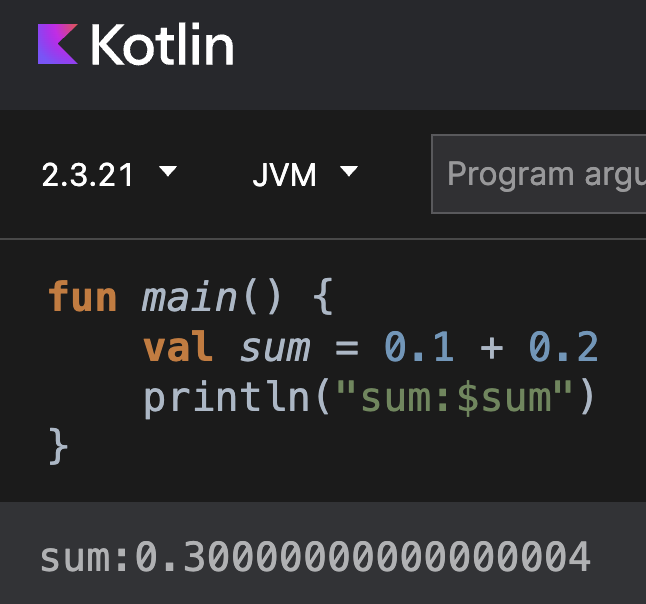
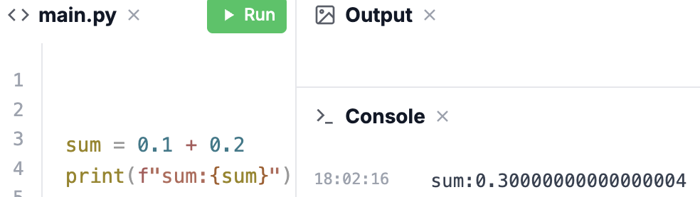
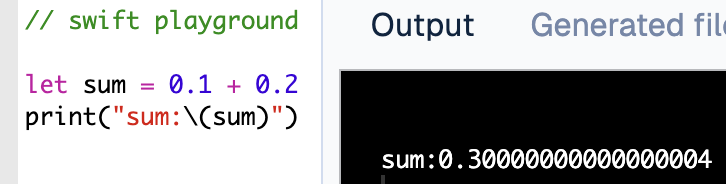
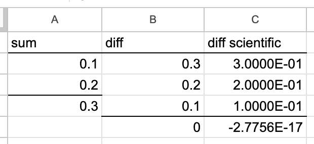

# decimal128 for multiple platforms

## The problem

 

## The solution

[UBD in-memory representation](docs/UBD.md)

[Cross-Platform Core Architecture](docs/XPlatformCoreArchitecture.md)

[Kotlin decimal128 implementation](https://decimal128.com/decimal128-kotlin)

# other

[Arbitrary-precision BigInt for Kotlin](https://decimal128.com/bigint-kotlin)

